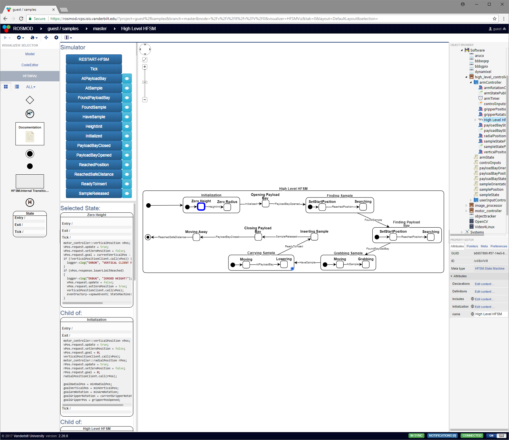
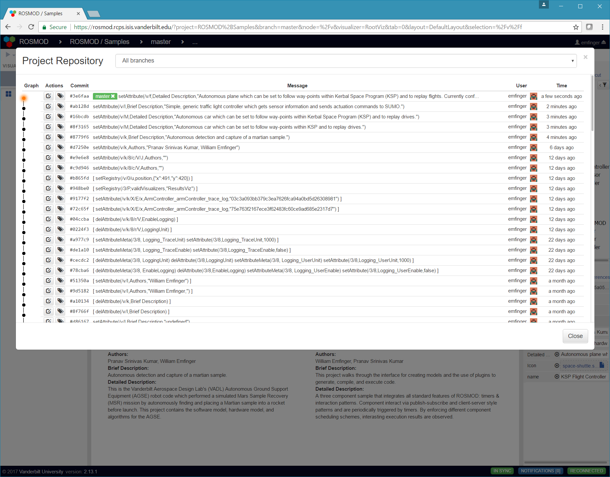
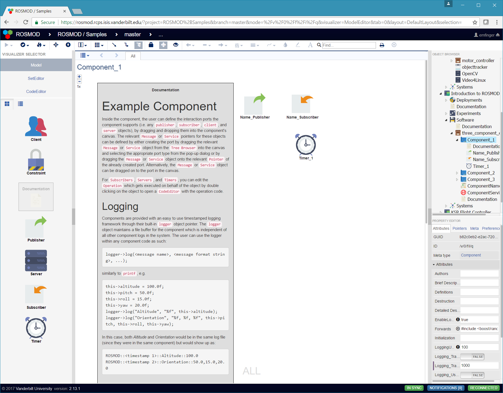
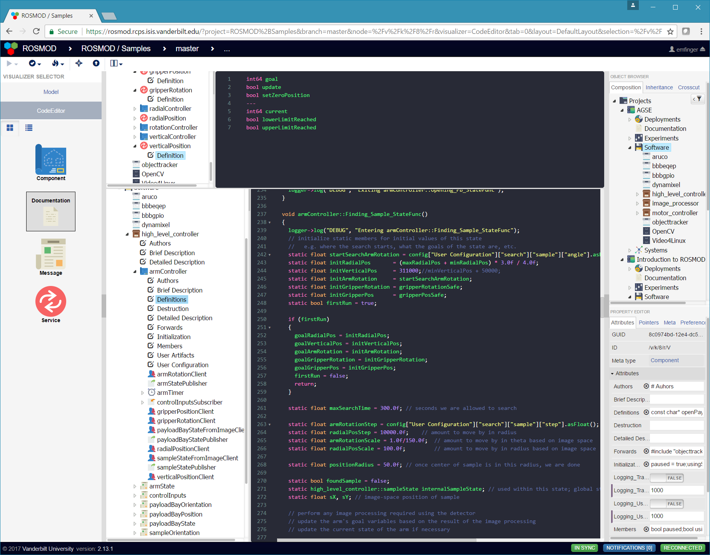
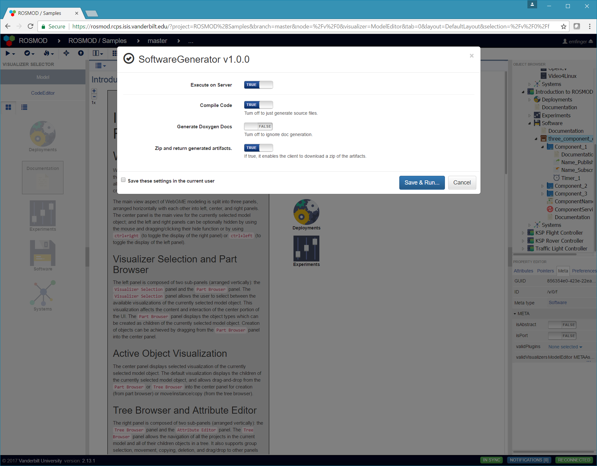
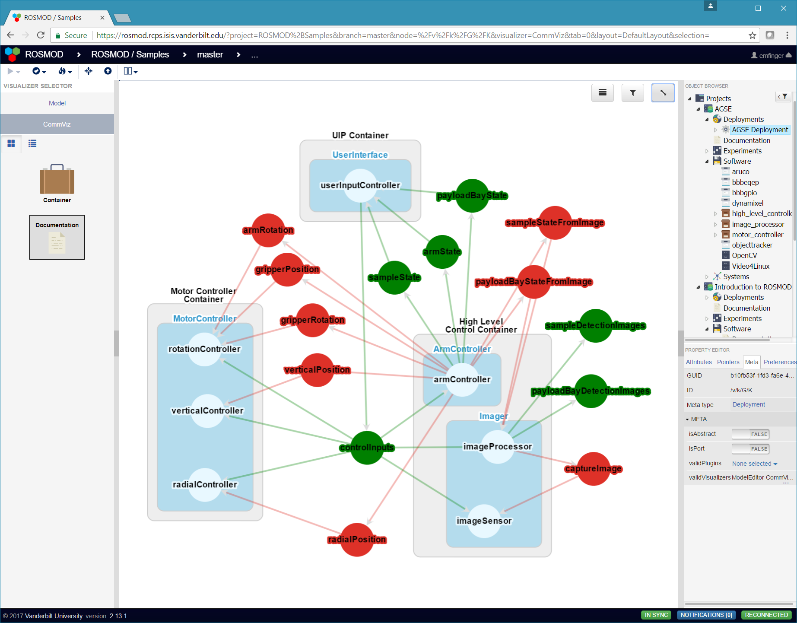
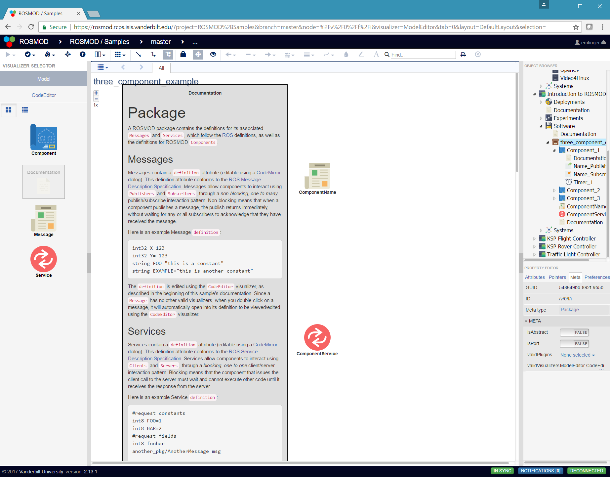
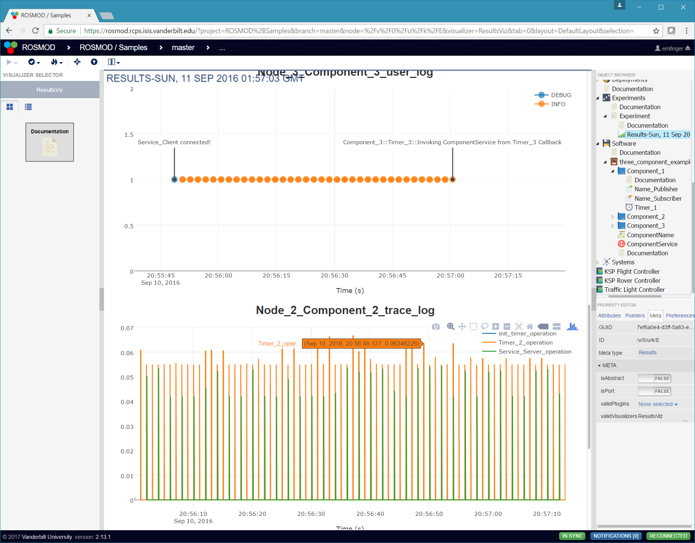
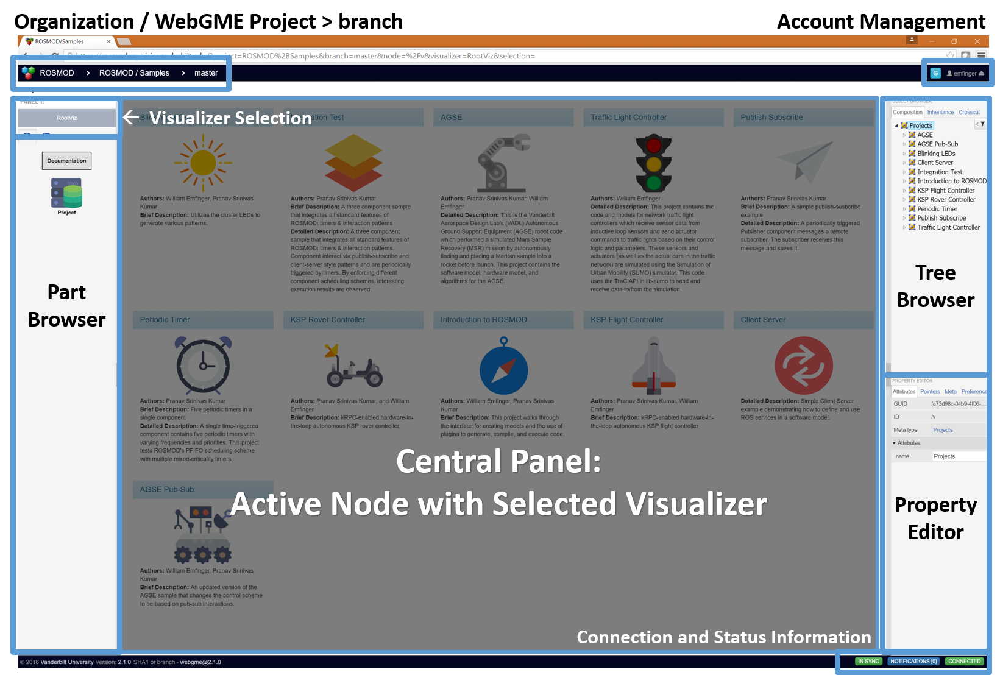

# ROSMOD

[](https://opensource.org/licenses/MIT)
[](https://github.com/rosmod/webgme-rosmod/wiki)
[](https://www.npmjs.com/package/webgme-rosmod)
[](https://www.npmjs.com/package/webgme-rosmod)
[](https://www.npmjs.com/package/webgme-rosmod)

[](https://rosmod.collaborative-design.org)

[](https://paypal.me/finger563)

This repository contains the implementation of
[ROSMOD - Journal of Electronics](http://www.mdpi.com/2079-9292/5/3/53),
built on [WebGME](http://github.com/webgme/webgme).

ROSMOD is a web-based, collaborative, modeling and execution
environment for distributed embedded applications built using
[ROS](http://www.ros.org).

An example server running ROSMOD can be found on
[rosmod.collaborative-design.org](http://rosmod.collaborative-design.org).

**Please see the [WIKI](https://github.com/rosmod/webgme-rosmod/wiki) for in-depth information about ROSMOD, how to use it, and links to various Youtube videos that walk through development and usage of ROSMOD.**

**Note: WebGME ROSMOD code generators have changed** - they no longer
generate for `rosmod-comm`, please see [Setting up target systems to
run ROSMOD](#setting-up-target-systems-to-run-rosmod) to properly
install the new dependencies.


## Contents

1. [What is ROSMOD](#what-is-rosmod)
    1. [Motivation](#motivation)
	2. [Implementation](#implementation)
	3. [Features](#features)
2. [How to set up ROSMOD](#how-to-set-up-rosmod)
    1. [Setting up the ROSMOD server](#setting-up-the-rosmod-server)
        1. [Required Dependencies](#required-dependencies)
        2. [Optional Dependencies](#optional-dependencies)
        3. [Start the Server](#start-the-server)
    2. [Setting up target systems to run ROSMOD](#setting-up-target-systems-to-run-rosmod)
3. [How to use ROSMOD](#how-to-use-rosmod)
    1. [Creating a ROSMOD project](#creating-a-rosmod-project)
       1. [Creating a WebGME project](#creating-a-webgme-project)
       2. [Creating a Single ROSMOD project](#creating-a-single-rosmod-project)
	2. [Modeling the Software](#modeling-the-software)
	3. [Modeling the Systems](#modeling-the-systems)
	4. [Creating a Deployment](#creating-a-deployment)
	4. [Creating an Experiment](#creating-an-experiment)
	   1. [Running an Experiment](#running-an-experiment)
	   2. [Stopping a Running Experiment](#stopping-a-running-experiment)
4. [Keeping ROSMOD up to date](#keeping-rosmod-up-to-date)


## What is ROSMOD?

The Robot Operating System Model-driven development tool suite,
(ROSMOD) an integrated development environment for rapid prototyping
component-based software for the Robot Operating System (ROS)
middleware.

ROSMOD consists of 
1. The *ROSMOD Server* (this repo), which provides collaborative
   model-driven development, and
2. The *ROSMOD Actor*
   ([github](https://github.com/rosmod/rosmod-actor)), which is a
   standardized `ros::Node` that provides a well defined component
   execution model which helps reduce the complexity of writing
   multi-threaded code.

### Motivation

Robotics is a discipline that involves integration between
heterogeneous fields such as electronics, mechanics, computer science,
control theory and artificial intelligence. During the design,
development and deployment of robotic systems, the components that
belong to the various sub-systems, e.g., image processing software,
servo-motors, power distribution system, etc., must work congruously
to achieve a common goal. As systems increase in complexity, software
development platforms must enable the creation of such components in a
rapid, reliable, and reusable manner while also providing
systems-level design, analysis, and deployment.

In other similar systems, users are often tasked with developing the
models, generating the code, and then manually touching the generated
code to implement the business logic for the various operations their
system needs to perform (e.g. periodic or event-triggered
functions). The injection and management of this user-developed code
inside the generated code can increase the learning curve for new
users as it adds some extra file management and build-system
overhead. Additionally, almost all other similar projects require
installation on the users' computers, which means they may need to
troubleshoot setting up the IDE, the compiler, and any other required
libraries (e.g. catkin, python, ssh, etc.) which will increase the
time it takes to configure their system and increase the number of
failure points in their configuration process (not to mention
increasing the platform and version control support nightmare).

To combat these issues, we wanted ROSMOD to act as a lightweight (from
the users' perspectives) IDE which does not require *any*
installation, and can be run cross-platform since it only relies on a
web-browser (even smartPhones can act as interfaces!). In this way,
the development of robotics with ROSMOD is done in a
**decentralized**, **collaborative**, **automatically versioned
development** , with **centralized management** of the infrastructure
(including any compatibility, package version management, and build /
deployment infrastructure management).

### Implementation

ROSMOD is implemented as a web-based graphical interface to a
versioned, git-like database of models with integrated code. Along
with this database exist server-side plugins which enable the
generation, compilation, and deployment of executable code. This
executable code is fully complete without the need for users to touch
or even download the files. These plugins have accses to the
file-system on the server, where the sys-admin for the ROSMOD
webserver has already configured the build system and deployment
infrastructure so that these plugins can automatically perform the
compilation and deployment as requested by the users.

### Features

* Integrated support for run-time monitoring using [ROS Bridge](http://wiki.ros.org/rosbridge_suite)

* Integrated support for run-time mission control / command and telemetry using [NASA OpenMCT](http://www.github.com/nasa/openmct) and [ROSMCT](http://www.github.com/rosmod/rosmct)

* Integrated Hierarchical Finite State Machine (HFSM) Modeling, Simulation, and Code Generation 

  See [webgme-hfsm](https://github.com/finger563/webgme-hfsm) for documentation, walkthroughs, videos, etc.
  
	

* Collaborative, automatically versioned web-based development

	

* Model-based framework for developing hardware and software

	

* Fully integrated code development, with documentation generation

	

* Fully integrated code generation, compilation, and deployment

	

* Interactive deployment visualization

	

* Embeddable documentation at every level of the model

	

* Distributed debugging enabled by automatic trace logging and
  plotting of trace and user logs

	

* Automatic load management of embedded targets

	I don't have a picture here because it's in the backend :)

## How to set up ROSMOD

### Setting up the ROSMOD Server

#### Required Dependencies 

1. Install [Node.js LTS](https://nodejs.org)
   ```bash
   cd ~/Downloads
   wget https://nodejs.org/dist/v8.11.1/node-v8.11.1-linux-x64.tar.xz
   tar xvf node-v8.11.1-linux-x64.tar.xz
   sudo cp -r node-v8.11.1-linux-x64/{bin,include,lib} /usr/.
   ```
2. Install Bower
   ```bash
   sudo npm install -g bower
   ```
3. Install [MongoDB](http://mongodb.com)
   ```bash
   sudo apt-get install mongodb

4. Clone this repo
   ```bash
   git clone https://github.com/rosmod/webgme-rosmod
   ```
5. Install dependencies
   ```bash
   cd webgme-rosmod
   npm install
   ```

#### Optional Dependencies

```
# for documentation generation
sudo apt-get install pandoc doxygen texlive-full

# for debugging
sudo apt-get install gdbserver gdb-multiarch valgrind

# add repo for rosbridge - this is copied from http://wiki.ros.org/kinetic/Installation/Ubuntu
sudo sh -c 'echo "deb http://packages.ros.org/ros/ubuntu $(lsb_release -sc) main" > /etc/apt/sources.list.d/ros-latest.list'
sudo apt-key adv --keyserver hkp://ha.pool.sks-keyservers.net:80 --recv-key 421C365BD9FF1F717815A3895523BAEEB01FA116
sudo apt-get update

# for connection to rosmct / rosbridge
sudo apt-get install ros-kinetic-rosbridge-suite
```
   
   
#### Start the server

```bash
npm start
```

*NOTE:* to make changes to the `META` or to view the `META`, you can run 

``` bash
npm run start-dev
```

which enables the `META` visualizer.

### Setting up target systems to run ROSMOD

**Note:** If you want to be able to compile on the server, you will need to follow these steps for the server as well.
**Note:** These steps have changed and no longer depend on `rosmod-comm`, please make sure to update your targets accordingly.

1. Install [ROS](http://www.ros.org) onto the target platform.
   
   *NOTE:* only *ros-\<version\>-ros-base* is required, but any install
    target works.
   
2. Install [ROSMOD-Actor](http://github.com/rosmod/rosmod-actor) onto
   the target platform. (Optionally) If you want to use `Action Clients` or `Action Servers` from [actionlib](https://github.com/ros/actionlib), you will need to **install our custom fork of actionlib** from [rosmod/actionlib](https://github.com/rosmod/actionlib).  To install both, simply copy these commands below.

   ```bash
   # install both rosmod/actionlib and rosmod/rosmod-actor to /opt/rosmod
   mkdir -p ~/rosmod_ws/src
   cd ~/rosmod_ws
   catkin config --extend /opt/ros/kinetic
   catkin config -i /opt/rosmod
   catkin config --install
   git clone https://github.com/ros/common_msgs.git src/common_msgs
   git clone https://github.com/rosmod/actionlib src/actionlib
   git clone https://github.com/rosmod/rosmod-actor src/rosmod-actor
   catkin build
   ```

3. Ensure the target has *SSH capabilities*; configure an ssh key that
   the ROSMOD server can use to remotely access the target device.
   
   *NOTE:* password-based authentication is not allowed for ROSMOD
    targets.

4. (Optional) If you want to perform **debugging** - you should install valgrind and gdbserver on the target systems

    ```bash
    sudo apt-get install valgrind gdbserver
    ```

## How to use ROSMOD

This section serves as a short guide for users who want to develop
robotics with ROSMOD. A more complete guide into what each of the
elements of a ROSMOD model is can be found in the
[Samples Seed](./src/seeds/samples.webgmex), which contains some
example projects for robots, autonomous cars, and automous planes, as
well as a simple `Introduction to ROSMOD` sample which is fully
documented (within the model using `Documentation` objects that render
[Markdown](https://en.wikipedia.org/wiki/Markdown) within the
model. This sample is hosted on the live server listed at the top of
this page, but can also be used as the base for any project created in
any deployment of the server since it is part of this repository.



### Creating a ROSMOD Project

In ROSMOD, there are two different types of `Projects`:

1. A WebGME Project which can contain any number of ROSMOD Projects,
   and which is the granularity at which you can authenticate for user
   / organization RWD access.
2. A ROSMOD Project, which is a self-contained model tree which
   describes the `Software`, `Systems`, `Deployments`, and
   `Experiments`.

#### Creating a WebGME project

To create a WebGME project, you open your web-browser (**NOTE: Google
Chrome is the fully-supported browser, YMMV with any other browser**)
and navigate to the web address of the ROSMOD server.

After you login (if authentication is enabled) you will be presented
with the WebGME landing page, which will show you the available
projects you have access to on the ROSMOD server, and will provide a
`Create New` button in the bottom left of the modal dialog that allows
you to create your own project. When creating a WebGME project, you
can either use one of the ROSMOD seeds (`base` or `samples`) as the
basis for your project or you can duplicate an existing project on the
server (that you have access to). The seeds provide the meta-model
that defines ROSMOD, and all projects made on the ROSMOD server start
out with one of the two seeds as a base.

#### Creating a single ROSMOD Project

Having created a WebGME project, you will see the ROSMOD Project Root
view, which shows all ROSMOD projects contained within the WebGME
project. If you copied an empty WebGME project or used the `base`
seed, then the page will be empty.

To create a ROSMOD project, you simply drag and drop the `Project`
object from the left panel (the `Part Browser`) into the empty space,
and a new ROSMOD Project will show up.

*Note:* single clicking within the project's space in the center panel
 will select the project within the `Property Editor` in the right
 panel which allows you to edit the Project attributes.

*Note:* to edit the `Authors`, `Brief Description`, or `Detailed
 Description` project attributes, you can double click on the text for
 those attributes within the center panel (the `Visualizer`) or you
 can single click on the attribute in the `Property Editor` in the
 right panel. 
 
*Note:* to edit the icon the displays for the project, you should
 click the `New Document` icon that is on the far right side of the
 `Icon` attribute in the `Property Editor` in the right panel. This
 will bring up a file upload dialog where you should select the **SVG
 Icon** you wish to associate with this project.

### Modeling the Software

Having created a ROSMOD project, double click on the project icon to
open the project within the `Visualizer`, which will automatically
switch to the `Model` *Visualizer*. With the project open in the
`Model` visualizer, drag a `Software` object into the center panel,
this `Software` object will be the root of the sub-tree that describes
all of the software for this project.

Within the software object, you can create any number of ROS
`Packages`, `Source Libraries`, and `System Libraries`.

Within a `Package`, you can define any number of ROS `Messages` and
ROS `Services`, as well as any number of ROSMOD `Components`.

Within a `Component`, you can define any number of ROS `Publishers`,
ROS `Subscribers`, ROS `Clients`, ROS `Servers`, and ROS `Timers`.

To edit the code defining any of these objects, click the `CodeEditor`
visualizer, which will bring up the CodeEditor's code attribute tree
on the left (in the active visualizer) and the code being edited on
the right.

### Modeling the Systems

Having created a ROSMOD project, double click on the project icon to
open the project within the `Visualizer`, which will automatically
switch to the `Model` *Visualizer*. With the project open in the
`Model` visualizer, drag a `Systems` object into the center panel,
this `Systems` object will be the root of the sub-tree that describes
all of the systems for which this project has been developed.

Double click the `Systems` object to open it. Within this aspect, you
can drag a `System` object to describe a single system. A **System**
is a collection of `Hosts` connected by one or more `Networks` and a
collection of `Users` which may have access to certain `Hosts`.

### Creating a Deployment

Having created a ROSMOD project, double click on the project icon to
open the project within the `Visualizer`, which will automatically
switch to the `Model` *Visualizer*. With the project open in the
`Model` visualizer, drag a `Deployments` object into the center panel,
this `Deployments` object will be the root of the sub-tree that describes
all of the deployment configurations for this project.

Double click on the `Deployments` object to open it. Within this
aspect, you can drag a `Deployment` object to describe a single
deployment. A **Deployment** is a collection of `Component Instances`
which are colocated into `Nodes` ( *POSIX processes* ), which are
themselves colocated into `Containers`. **Containers** are abstract
representations of computing hardware.

### Creating an Experiment

Having created a ROSMOD project, double click on the project icon to
open the project within the `Visualizer`, which will automatically
switch to the `Model` *Visualizer*. With the project open in the
`Model` visualizer, drag an `Experiments` object into the center
panel, this `Experiments` object will be the root of the sub-tree that
contains all of the current experiments, past experiments, and their
results for this project.

Double click on the `Experiments` object to open it. Within this
aspect, you can drag an `Experiment` object to describe an experiment
you wish to run. *An experiment maps a* `Deployment` *to a*
`System`. To configure the experiment with the deployment you want to
run and the system on which you wish to run it, you can drag from the
`Object Browser` in the right panel a `Deployment` and a `System`
(that must be within the same ROSMOD project onto the `Experiment`
object you have created. The `Experiment` will turn green while your
drag is over it, indicating the `Experiment` is a valid drop target
for the object you are dragging. This will set the respective `System`
or `Deployment` **pointer** within the `Experiment` object. To view
(or set or clear) the value for these pointers, single click on the
`Experiment` to select it within the `Property Editor` panel. With the
`Experiment` active in the `Property Editor`, press the property
editor's `Pointers` tab, which will show the pointers the object has.

**NOTE: Never alter an object's base pointer!**

#### Running an Experiment

To run an experiment, simply execute the `RunExperiment` plugin. The
plugin will automatically check to ensure that the system pointed to
by the experiment is running and has the available resources while
also satisfying the constraints of the software.

If the experiment successfully deploys to the system, the plugin will
update the model to show which containers from the deployment mapped
to which hosts of the system.

#### Stopping a Running Experiment

If the experiment has a valid model mapping containers to hosts (which
can only be created by running an experiment), then the
`StopExperiment` plugin will stop the experiment's processes and copy
the component and ROS logs back into the model as attributes of a
time-stamped `Results` object.

Opening the `Results` object generated by the `StopExperiment` plugin
will open the `ResultsViz` visualizer which will automatically plot
the logs recovered from the experiment.

## Keeping ROSMOD Up-to-Date

To keep ROSMOD up to date, you simply need to periodically stop the
server, pull from the repository, update the npm packages, and then
restart the server.

``` bash
# 1. within the terminal that is running the server press ctrl+c to stop the server
^C
# 2. pull
git pull
# 3. update
npm update
# 4. restart
npm start
```
